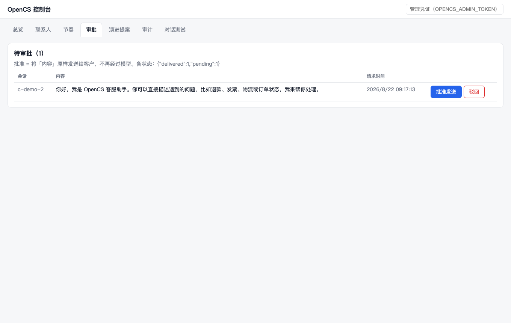
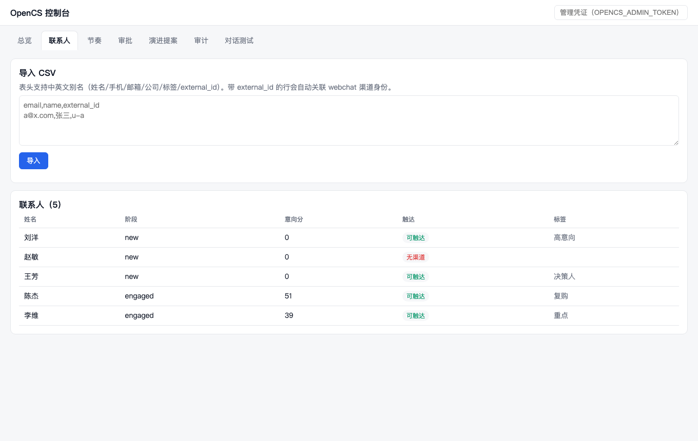

# OpenCS-DSH

自托管的 AI 客服 / 增长 Agent，**基于 [DeepSeek Harness (dsh)](https://github.com/deepseek-harness) 内嵌构建**。

**产品主站：http://dipingxian.tech/open-customer-service-dsh/**

> 导入名单 → 自动节奏触达 → 客户一回复即停。
> Agent 的**每个动作**都过风险分级，自由回复默认进审批队列——**批准的就是发出的**，全程审计可回放。
> Agent 从低分对话里自提改进，但改行为准则永远要人点头。
> 业务数据全在你自己的机器上，模型可全私有部署；不按坐席收费，默认安全——**放开自动化是你的决策，而不是我们的默认值**。

这是 [`open-customer-service`](../open-customer-service)（Python / FastAPI）的完全重写版：
Agent 运行时不再自建，转由 dsh 承担；OpenCS 只保留 dsh 不提供的 CS/CRM 业务语义。

> **状态**：核心链路与产品化层已完成并端到端验证。
>
> | 已完成 | 待办 |
> |---|---|
> | dsh 内嵌 agent 内核 · 渠道网关（webchat + **企微客服**）· HTTP/WS 帧协议 · FTS5 知识库与热重载 · 技能库与两轮选择 · CRM 漏斗与分群 · 节奏引擎与全自动成单 · CS 评测 · 演进门禁 · **管理面鉴权 · HITL 审批闭环 · 持久化审计 · webhook 频控 · 管理控制台 · OpenAI 兼容网关** · Docker | 技能自策展 / 消融实验 / 回放差分器 · 多实例水平扩展（BullMQ 切换点已预留） |
>
> 进度见 `docs/superpowers/plans/`，客户交付文档见 [`docs/DEPLOYMENT.md`](docs/DEPLOYMENT.md)。

---

## 为什么基于 dsh

Python 版里约 25% 的代码是在自建 agent 运行时（Orchestrator、ToolRegistry、
ToolExecutor、ActionGuard、L0 事件库、LLMClient）。这些在 dsh 里都有框架级实现：

| Python 版自建 | dsh 原生 |
|---|---|
| `Orchestrator` 三阶段循环 | `ctx.agentLoop` |
| `ToolRegistry` + `ToolExecutor` | `ctx.tools` + `defineTool` |
| `ActionGuard` 六档风险 + HITL | `tools/pre-execute` guard 链 + `ctx.approval` |
| `L0RawEventStore` 事件溯源 | `ctx.sessions` + session persistence |
| `LiteLLMClient` | `ctx.llm` adapter 注册制 |
| 多 worker 路由 | `ctx.subagents`（工具白名单 spawn 时固化） |

换来的净增能力：长会话 compaction、MCP 工具零代码接入、结构化会话回放。

完整调研见 [`docs/superpowers/research/2026-08-21-dsh-rewrite-research.md`](docs/superpowers/research/2026-08-21-dsh-rewrite-research.md)，
设计见 [`docs/superpowers/specs/2026-08-21-opencs-dsh-design.md`](docs/superpowers/specs/2026-08-21-opencs-dsh-design.md)。

---

## 依赖 dsh 的方式（重要）

本项目通过 pnpm `link:` 依赖**本地 checkout** 的 dsh，而不是 npm 版本号：

```
dsh 仓库：  ../deepseek-harness
锁定版本：  0.1.0-rc.5
锁定 commit：47f943859b
```

**原因**：rc.5 未发布到 npm；npm 上的 rc.8 / 0.1.1-rc.1 与本项目全部调研所依据的
源码存在 API 漂移风险，而 dsh 官方明确「THERE WILL BE COMPATIBILITY-BREAKING CHANGES」。

**对冲**：`tests/contract/dsh-api.test.ts` 断言我们依赖的每个 dsh 导出符号存在且形状正确。
升级 dsh 时先跑契约测试定位破坏面，再跑全量回归。

### 准备 dsh

```bash
bash scripts/setup-dsh.sh   # clone 公开仓库到 ../deepseek-harness、checkout 锁定 commit、构建
```

等价手动步骤：

```bash
# 与本仓库同级
git clone https://github.com/deepseek-ai/deepseek-harness.git ../deepseek-harness
cd ../deepseek-harness && git checkout 47f943859b && pnpm install && pnpm build
```

---

## 快速开始

```bash
pnpm install
pnpm smoke          # 离线冒烟：无需任何 API key，全链路验证
pnpm test           # 全量测试
pnpm typecheck
pnpm dev            # 起服务 → http://localhost:8080
```

未配置 LLM API key 时自动降级为**确定性 mock 模型**——完整走 agent loop、
guard、工具执行与 session 持久化，只是 token 由规则生成。CI 无 key 也能全绿。

打开 **http://localhost:8080/console** 即是管理控制台（总览 / 联系人导入 /
节奏 / 审批队列 / 演进提案 / 审计 / 对话测试），单文件零构建，随服务分发。

| 审批队列：批准的就是发出的 | 联系人：不可触达显式标注 |
|---|---|
|  |  |

### 试一下：客服问答

```bash
curl -X POST localhost:8080/channels/webchat \
  -H 'content-type: application/json' \
  -d '{"conversation_id":"c1","customer_id":"u1","text":"买的东西想退款，还来得及吗"}'
```

```jsonc
{
  "conversation_id": "c1",
  "reply": "[售后 / 退款政策] 签收后 7 天内可无理由退款…",  // 发给客户的话
  "agent_narration": "我帮你确认一下退款政策。",              // 模型的内部叙述
  "delivered": true,
  "frames": [ /* text/delta、tool/status、card/open|item|close */ ],
  "trace": { "from_seq": 1, "to_seq": 34 }
}
```

WebSocket：`ws://localhost:8080/ws/conversations/:id?customer_id=u1`
连接时先收到 `{type:"history",frames:[...]}`，之后实时收帧。
**重连收到的历史与当时实时收到的逐帧一致**——两者共用同一个纯投影函数。

### 试一下：全自动外呼成单

```bash
B=localhost:8080

# 1. 导入名单（external_id 用于关联渠道身份；没有它的人算「不可触达」）
curl -X POST $B/admin/tenants/default/contacts/import -H 'content-type: application/json' \
  -d '{"csv":"email,name,external_id\nzhang@x.com,张三,u-zhang\n","channel_id":"webchat"}'

# 2. 预览受众
curl -X POST $B/admin/tenants/default/contacts/segment-preview -H 'content-type: application/json' \
  -d '{"rules":[{"field":"addressable","operator":"eq","value":true}]}'

# 3. 建节奏并激活
curl -X POST $B/admin/tenants/default/cadences -H 'content-type: application/json' -d '{
  "name":"首触","channel_id":"webchat","sender_persona":"OpenCS 的小林",
  "auto_enroll":true,
  "entry_filter":{"rules":[{"field":"addressable","operator":"eq","value":true}]},
  "steps":[{"step_order":0,"delay_seconds":0,"template":"{{name}}你好，我是小林。"}]
}'
curl -X POST $B/admin/tenants/default/cadences/<id>/activate

# 4. 看统计（引擎每 60 秒自动 tick；也可手动触发）
curl -X POST $B/admin/tenants/default/cadences/tick
curl $B/admin/tenants/default/cadences/stats
```

**节奏步骤两种模式**，创建时 API 会标注出来：

| 模式 | 触发条件 | 耗时 | 用在哪 |
|---|---|---|---|
| `template` | 填了 `template` | 毫秒级 | **大批量首触必须用这个**（5000 人 × LLM = 55 小时） |
| `llm` | 只填 `goal` | ~40 秒/条 | 高价值跟进步骤 |

**不打扰规则**：静默时段（默认 22:00–09:00，IANA 时区）、周频控（默认 3 次）、
客户一回复即退出节奏、到达 `exit_on_stage` 即退出。

---

## Docker 部署

因为 dsh 以 `link:` 引用本地 checkout，**构建上下文是两个仓库的共同父目录**：

```bash
cd ..   # 到 deepseek-harness 与 open-customer-service-dsh 的父目录
OPENCS_ACTION_TOKEN_SECRET=$(openssl rand -hex 32) \
DEEPSEEK_API_KEY=sk-xxx \
docker compose -f open-customer-service-dsh/docker-compose.yml up --build
```

`knowledge/` 与 `skills/` 以只读卷挂入——运营改 `.md` 即时生效，无需重建镜像。
运行期数据在 `/data` 卷里，容器重建不丢联系人与会话。

## 架构

```
apps/admin-web (Next.js，待迁移)
        │ HTTP / WS
┌───────▼─────────────────────────────────────────┐
│ src/gateway   Fastify 5                          │
│  /channels/webchat  /ws/conversations/:id        │
│  /health/live  /health/ready                     │
└───────┬─────────────────────────────────────────┘
        │
┌───────▼──────────────┐   ┌────────────────────────┐
│ dsh Context（内嵌）    │   │ 自研业务层               │
│  agents / agentLoop   │◄──┤  channel/  渠道网关      │
│  tools（defineTool）  │   │  crm/      联系人 · 漏斗  │
│  llm / sessions       │   │  nurture/  节奏引擎      │
│  systemPrompt         │   │  knowledge/ FTS5 知识库  │
│  subagents / jobs     │   │  evolution/ 演进门禁     │
│  skills（SKILL.md）   │   │  evaluation/ CS 评测     │
└──────────────────────┘   └────────────────────────┘
```

### 闭环学习

```
每轮回复 → 确定性评测（越权承诺/语气/推进度，零成本、不调模型）
         → 低分会话沉淀为证据
         → agent 调 evolution.propose 提改进
         → 门禁判定（改行为准则的一律 needs_human）
         → 人工审批 → 生效
```

**改变 agent 行为准则的提案永远需要人工确认。** `skill` / `cadence` 维度与任何
`deprecate` 动作强制走人工；自动放行默认关闭。让模型自主改写自己的准则，
等于把「不做超范围承诺」这条红线交给它自己决定要不要遵守。

### 三条核心纪律

1. **LLM 永不直接执行不可逆动作**
   发消息 / 改生命周期 / 写标签一律经 `defineTool` 收口，由 `tools/pre-execute`
   guard 链做租户隔离 + 风险分级 + 频控。`channel.reply` 默认 ORANGE_C 档——
   回复**进入审批队列**（不是消失）：运营在控制台看到将发送的原文，
   批准后系统确定性投递，**批准的就是发出的**，不再经过模型。
   放开自动回复靠改 `OPENCS_AUTO_APPROVE_TIERS`，是一个**显式的运营决策**。

2. **卡片不是自建协议，是 `defineTool` 的 `presentationMeta`**
   纯函数投影，随 `tool/result` 事件持久化 → 回放免费，实时与历史不可能不同步。

3. **Model-visible ⟺ logged**
   进入模型请求的任何内容都必须能从 session 日志重建，否则回放不成立。

### 风险分级

| 档 | 名称 | 默认 | 典型工具 |
|---|---|---|---|
| 0 | GREEN | 放行 | `knowledge.search` `crm.get_order` |
| 1 | YELLOW | 放行 | `contact.add_note` `memory.write_l2` |
| 2 | ORANGE_A | 放行（频控） | `channel.send_template` |
| 3 | ORANGE_B | 放行（频控+审计） | `nurture.deliver` |
| 4 | ORANGE_C | **人工确认** | `channel.reply` |
| 5 | RED | **人工确认** | `contact.update_stage` `contact.mark_won` |

未在 `src/harness/risk.ts` 登记的工具落到 ORANGE_C —— 新增工具忘记登记时会走审批而非放行。

---

## 配置

| 变量 | 默认 | 说明 |
|---|---|---|
| `OPENCS_ENV` | `development` | `development` / `test` / `production` |
| `OPENCS_DATA_DIR` | `./data` | SQLite 与 session 日志目录 |
| `OPENCS_KNOWLEDGE_DIR` | `./knowledge` | Markdown 知识库 |
| `OPENCS_SKILLS_DIR` | `./skills` | SKILL.md 技能库 |
| `OPENCS_TENANT_ID` | `default` | 默认租户 |
| `OPENCS_HOST` / `OPENCS_PORT` | `0.0.0.0` / `8080` | 监听地址 |
| `DEEPSEEK_API_KEY` | — | 配置后走 dsh-llm-deepseek |
| `OPENAI_API_KEY` / `OPENAI_BASE_URL` | — | OpenAI 兼容网关（自建代理/中转均可） |
| `OPENCS_MODEL` | `deepseek-chat` | 模型 id |
| `OPENCS_ACTION_TOKEN_SECRET` | — | **生产必填**，≥32 字节 |
| `OPENCS_ADMIN_TOKEN` | — | **生产必填**，≥16 字节；管理 API / 控制台的 Bearer 凭证 |
| `OPENCS_WEBHOOK_RATE_LIMIT` | `20` | webhook 每会话每分钟消息上限 |
| `OPENCS_AUTO_APPROVE_TIERS` | `0,1,2,3` | 自动放行的风险档 |
| `OPENCS_NURTURE_ENABLED` | `true` | 节奏引擎开关（P5） |
| `OPENCS_NURTURE_POLL_INTERVAL` | `60` | tick 间隔（秒） |
| `OPENCS_NURTURE_DRAIN_CONCURRENCY` | `8` | 并发投递数 |
| `OPENCS_NURTURE_LEASE_SECONDS` | `300` | 发件租约时长 |
| `WECOM_*` | — | 企微客服四件套（CORP_ID/CORP_SECRET/TOKEN/ENCODING_AES_KEY），接入步骤见 DEPLOYMENT.md |
| `LANGFUSE_*` | — | 可选观测 |

生产环境缺少必填项或降级为 mock 模型会**直接启动失败**，不静默降级。

---

## 测试

| 层 | 位置 | 说明 |
|---|---|---|
| 契约 | `tests/contract/` | 锁定 dsh 依赖面，升级时先跑这层 |
| 单元 | `tests/unit/` | 纯函数（帧投影、卡片降级、风险档、频控、渠道解析） |
| 集成 | `tests/integration/` | **真实 `assembleHarness()`**，不允许只 mock Context |
| 端到端 | `tests/e2e/` | 真实 Fastify + 真实 runtime 对象图 |

```bash
pnpm test        # 424 tests
pnpm smoke       # 离线全链路冒烟
```

### 四个 Python 版生产 bug 的回归防线

| 教训 | 修复 | 守住它的测试 |
|---|---|---|
| #1 LLM 自称是客户的公司 | system + user prompt 双层身份边界 | `tests/unit/nurture.test.ts` · `tests/e2e/lead-to-close.test.ts` |
| #2 租约超时导致重复发送 | 唯一约束 + 租约 + **并发 drain** | `tests/unit/nurture.test.ts` · `tests/e2e/lead-to-close.test.ts` |
| #3 按手机号建重复联系人 | 身份三分，渠道身份优先查找 | `tests/e2e/crm.test.ts` |
| #4 无渠道身份被静默丢弃 | `unaddressable` 显式抛错 + 记时间线 | `tests/unit/crm.test.ts` · `tests/e2e/crm.test.ts` |

---

## 开发工具

```bash
tsx scripts/dev/ws-probe.ts   # 连 WS 发消息，打印帧序列并验证重连历史一致
bash scripts/setup-dsh.sh     # 一键准备 dsh 依赖（clone + checkout 锁定 commit + 构建）
bash scripts/backup.sh        # 数据一致性备份（SQLite .backup + sessions 打包轮转）
```

---

## 销售与交付材料

| 文档 | 给谁看 |
|---|---|
| [产品一页纸](docs/sales/one-pager.md) | 客户决策人（对外宣传） |
| [演示脚本](docs/sales/demo-script.md) | 售前（15 分钟演示，含话术与 Q&A 速查） |
| [安全与数据主权说明](docs/sales/security-whitepaper.md) | 客户安全团队 |
| [常见问题](docs/sales/faq.md) | 采购 / 技术评估 |
| [定价与交付模式](docs/sales/pricing.md) | 商务（含销售红线） |
| [交付检查单](docs/sales/delivery-checklist.md) | 交付工程师（含真实 LLM 冒烟清单） |
| [部署清单](docs/DEPLOYMENT.md) | 客户运维 |

---

## License

Apache-2.0
