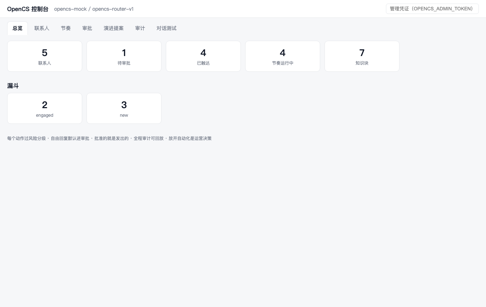

# OpenCS —— 自托管 AI 客服 + 增长引擎（产品一页纸）

> 导入名单 → 自动节奏触达 → 客户一回复即停。
> Agent 的**每个动作**都过风险分级，自由回复默认进审批队列——**批准的就是发出的**，全程审计可回放。
> Agent 从低分对话里自提改进，但改行为准则永远要人点头。
> 业务数据全在你自己的机器上，模型可全私有部署；不按坐席收费，默认安全——**放开自动化是你的决策，而不是我们的默认值**。

---

## 解决什么问题

| 你的现状 | OpenCS 之后 |
|---|---|
| 客服团队 80% 时间在回答重复问题 | 知识库驱动的 AI 回答，运营改 Markdown 即时生效 |
| SaaS 客服按坐席收费，扩量就涨价 | 自托管一次交付，坐席数与消息量不再计费 |
| 用 AI 又怕它「乱承诺、乱发话」 | 自由回复**默认进人工审批**，批准的原文才发出 |
| 外呼靠人肉 Excel + 手动跟进 | 名单导入 → 节奏引擎自动触达，客户一回复即停 |
| 客户数据交给第三方 SaaS | 全部数据在你的机器：SQLite + 本地会话日志 |
| AI 出了错查不到原因 | 每个动作有审计记录，会话可逐帧回放 |

## 核心能力

- **多渠道客服**：网页聊天（HTTP + WebSocket 实时流）、**企业微信客服**（签名校验 + 加解密）
- **知识库问答**：Markdown 即知识库，FTS5 全文检索，改文件热生效，答案标注来源
- **CRM 漏斗**：CSV 导入、渠道身份关联、生命周期阶段、意向评分、规则分群
- **节奏外呼**：模板批量首触（毫秒级）+ LLM 个性化跟进；静默时段 / 周频控 / 回复即停 / 到阶段即停
- **六档风险分级**：从「查知识库」到「标记成单」，每个工具动作分级管控，未登记的默认收紧
- **HITL 审批闭环**：待发内容在控制台原文可见，批准后确定性投递，不再经过模型
- **闭环学习**：每轮回复零成本自动评测 → 低分沉淀证据 → Agent 自提改进提案 → **影子运行验证（同输入重跑，看是否真的修了坏例）** → 人工门禁把关
- **管理控制台**：总览 / 联系人 / 节奏 / 审批 / 演进提案 / 审计 / 对话测试，单文件零构建

## 三条安全纪律（写进架构，不是宣传语）

1. **LLM 永不直接执行不可逆动作**——发消息、改生命周期、写标签全部经工具层收口，guard 链做租户隔离 + 风险分级 + 频控
2. **批准的就是发出的**——审批通过的原文由系统确定性投递，模型无法再篡改
3. **Model-visible ⟺ logged**——进过模型的内容都能从会话日志重建，回放不是「大概如此」而是逐帧一致

## 数据主权

- 业务数据（联系人 / 会话 / 审计 / 知识库）**全部落在你自己的服务器**，SQLite 文件级备份
- 模型调用两种模式：DeepSeek 官方 API（性价比），或**任意 OpenAI 兼容端点**——接你自建的 vLLM / Ollama 即可实现**全量数据不出机房**

## 部署形态

- Docker Compose 一键起，单机即可运行；健康探针 / 只读配置卷 / 数据卷齐备
- 无外部依赖（无 Redis / 无消息队列 / 无托管数据库）——一台 2C4G 的机器就能跑
- 生产环境缺少安全配置**直接拒绝启动**，不静默降级

## 适合谁

电商 / 教育 / 本地服务等**有私域运营诉求**、对**数据合规敏感**、客服与增长团队 50 人以下的团队。
需要横向多实例、多租户 SaaS 化的场景请与我们聊路线图。

---

**演示**：15 分钟在线演示或自助跑通（见 [demo-script.md](demo-script.md)）
**安全评审材料**：[security-whitepaper.md](security-whitepaper.md) · **常见问题**：[faq.md](faq.md)
**联系**：sunxing2017@gmail.com
